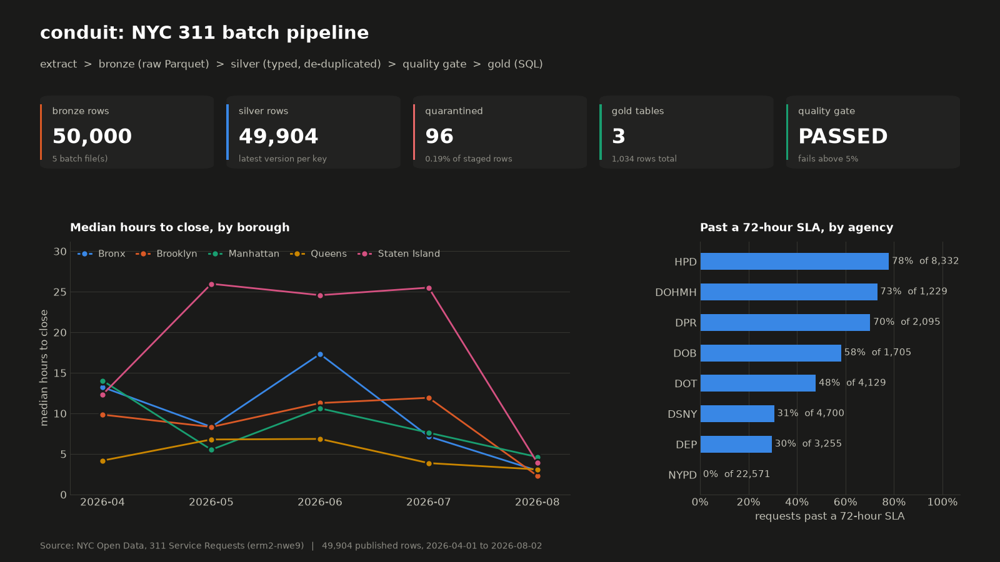
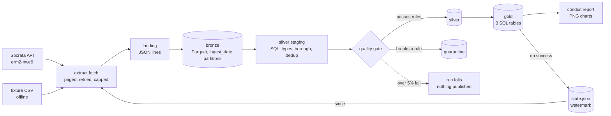
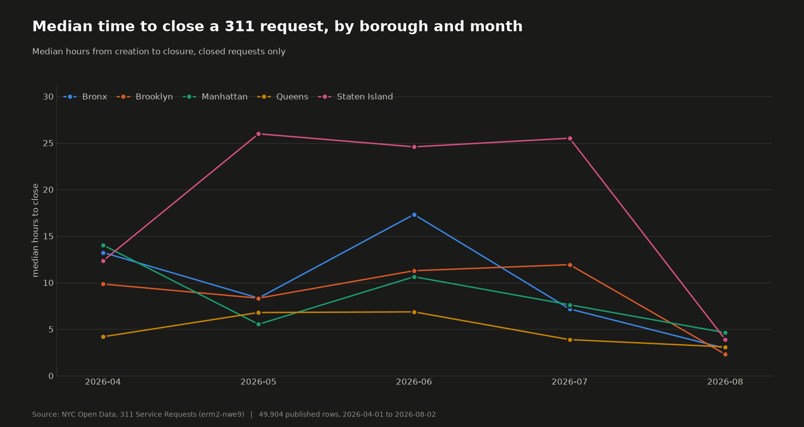
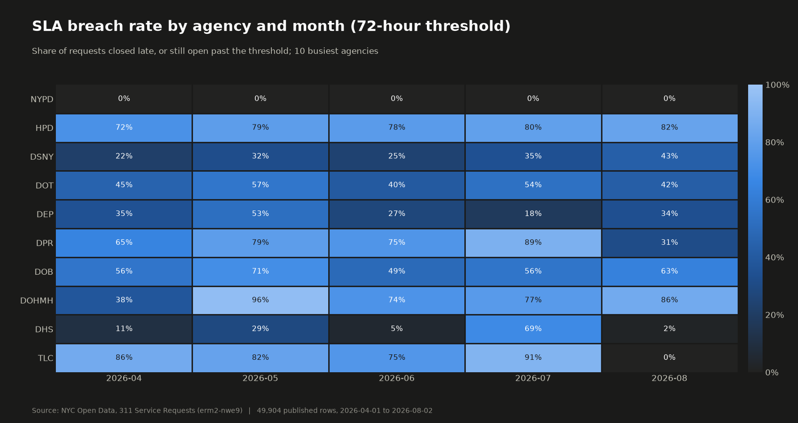
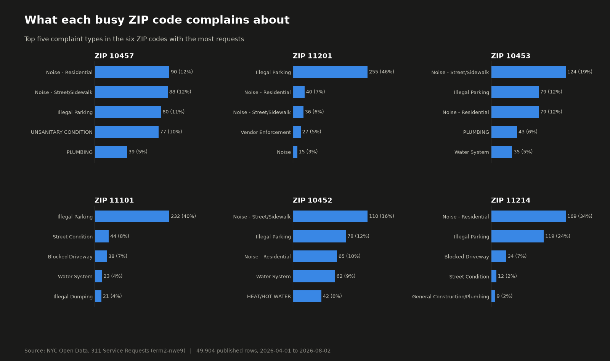
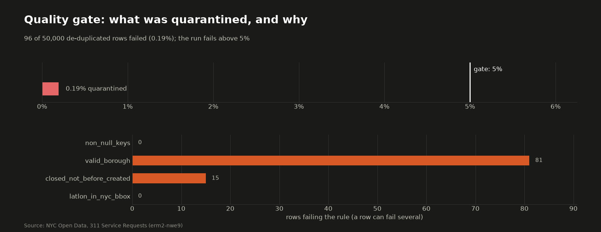

# conduit-311-pipeline

[](https://github.com/armaghanrashid/conduit-311-pipeline/actions/workflows/ci.yml)

A batch ETL pipeline over the public NYC 311 service-request dataset: raw landing, typed and de-duplicated silver, SQL gold tables, and a data-quality gate that quarantines bad rows and fails the run when too many of them appear.



## Why it's interesting

- **Idempotent by construction.** Bronze batches are named by a hash of their contents, silver and gold are pure functions of bronze, and the watermark only moves after every stage succeeds. Re-running adds zero rows and a failed run is simply retried (tested).
- **A quality gate that can say no.** Four rules split rows into silver and quarantine, each quarantined row records every rule it broke, and a run that quarantines more than 5% publishes nothing and keeps its watermark where it was.
- **Reviewable infrastructure, not just code.** The transforms are plain DuckDB SQL files, and the target platform (S3 lake, Glue catalog, Athena workgroup, ECR, a scheduled Fargate task, least-privilege IAM) is described in Terraform that CI formats and validates on every push. It is never applied.

## Architecture



| Layer | Contents | Written as |
|---|---|---|
| landing | the rows exactly as pulled, one JSON object per line | `data/landing/<batch>.jsonl` |
| bronze | the same rows as all-string Parquet plus `_batch_id`, `_source`, `_ingested_at` | `data/bronze/ingest_date=YYYY-MM-DD/<batch>.parquet` |
| silver | typed, ZIP and borough standardised, one row per `unique_key`, `response_hours` added | `data/silver/silver_311/` |
| quarantine | rows that broke a rule, with a `failed_rules` column | `data/quarantine/quarantine_311/` |
| gold | `response_time_by_borough_month`, `top_complaints_by_zip`, `sla_breach_rate` | `data/gold/<table>/` |

The SQL lives in [`sql/`](sql): `silver_311.sql` and one `gold_*.sql` per table. Python only moves data between them.

## Quickstart

From a clean clone (Python 3.12). Nothing needs an account or key.

```bash
python3.12 -m venv .venv && source .venv/bin/activate
pip install -r requirements.txt && pip install --no-deps -e .

# Offline, against the 500-row synthetic fixture
conduit run --source fixture
conduit run --source fixture      # second run: fetched 0, nothing changes
conduit report                    # writes docs/media/*.png and prints a markdown summary

# Live, from the NYC Open Data API (never more than 50,000 rows per run)
conduit run --source api --since 2026-04-01 --until 2026-05-01 --limit 10000
```

`scripts/real_run.sh` is the exact live run reported below. Useful flags: `--lookback-days N` re-pulls the last N days before the watermark to catch tickets that were closed later, `--threshold 0.05` sets the gate, `--sla-hours 72` sets the SLA used by gold. `data/` is git-ignored; no pulled data is ever committed.

## Results

One real run against the live API: the first 10,000 requests of each month from April to August 2026, five polite requests of 10,000 rows (50,000 in total, 0.25 s pause between pages). Each window was a separate `conduit run`, so the watermark and incremental logic ran five times on real data.

```text
window   fetched   silver rows (cumulative)   quarantined (cumulative)   gate
2026-04   10,000                    10,000                         46   PASSED  (0.46%)
2026-05   10,000                    20,000                         57   PASSED  (0.29%)
2026-06   10,000                    30,000                         71   PASSED  (0.24%)
2026-07   10,000                    40,000                         84   PASSED  (0.21%)
2026-08   10,000                    50,000                         96   PASSED  (0.19%)
re-run        0                    50,000                         96   PASSED  (unchanged)
```

Final state of the lake (`conduit report` output):

| layer      | table                                          |    rows |
|------------|------------------------------------------------|---------|
| bronze     | raw rows in 5 batch file(s)                    |  50,000 |
| bronze     | distinct unique_key                            |  50,000 |
| silver     | silver_311 (published, latest version per key) |  49,904 |
| quarantine | quarantine_311 (failed a quality rule)         |      96 |
| gold       | response_time_by_borough_month                 |      25 |
| gold       | top_complaints_by_zip                          |     941 |
| gold       | sla_breach_rate                                |      68 |

- created_at range: 2026-04-01 to 2026-08-02 (5 calendar months)
- quality gate: 96 of 50,000 de-duplicated rows quarantined = 0.19% (fails above 5%)
- rows failing each rule: non_null_keys: 0, valid_borough: 81, closed_not_before_created: 15, latlon_in_nyc_bbox: 0
- SLA threshold used for gold: 72 hours

The 81 borough failures are requests whose borough the city recorded as `Unspecified`; the 15 timing failures are tickets the source shows as closed before they were created. 1,342 published rows have no coordinates, which the gate allows (coordinates are checked only when present).

| | |
|---|---|
|  |  |
|  |  |

These figures describe a sample, not the city. Each month contributes only its first 10,000 requests (roughly the first day), so the monthly gold tables show how the pipeline behaves across months, not citywide monthly statistics.

## Testing

```bash
pytest -q        # 62 tests, a few seconds, no network
ruff check . && ruff format --check .
```

The suite covers the behaviours the pipeline promises:

- **Dedup keeps the latest version**, regardless of the order batches arrive in, with ingest time as the tie-break; rows without a key are kept for quarantine rather than collapsed.
- **The quality gate quarantines bad rows**, one parametrised test per rule, a row breaking several rules is tagged with all of them, and missing coordinates are tolerated.
- **The 5% threshold fails the run**: exactly 5% passes, 6% fails, a failed run publishes no silver or gold and leaves the watermark untouched, and the same run succeeds once the upstream data is corrected.
- **Incremental re-runs add 0 duplicate rows**: a second run fetches nothing, a run with a lookback window re-fetches everything and still leaves one row per key and the same bronze file, and a late update to an old ticket is picked up.
- Extraction is tested against a mocked API: paging parameters, the `$where` window, exponential backoff on 429 and 5xx, giving up after the attempt limit, no retry on a 400, and the 50,000-row cap.

CI (`.github/workflows/ci.yml`) runs ruff, pytest, the fixture pipeline twice (asserting the second run fetches 0) plus `conduit report`, and, in a second job, `terraform fmt -check` and `terraform init -backend=false && terraform validate` with no credentials.

## Design decisions and trade-offs

- **Silver is rebuilt from all of bronze every run.** This makes "latest version wins" correct whatever order data arrived in, and makes re-runs trivially idempotent. The cost grows with total history; at much larger scale it would become a partition-pruned merge.
- **"Latest" means the source's `resolution_action_updated_date`**, then ingest time, then batch id, so a stale copy arriving late cannot overwrite a fresher one.
- **The watermark is `created_date`, as specified, which cannot see updates to old tickets.** `--lookback-days` re-pulls a trailing window and the dedup absorbs the overlap; without it, a ticket closed after its window was ingested stays open in silver.
- **The gate sits on de-duplicated rows, before publication.** Counting duplicates would double-count a bad ticket; publishing before checking would let bad rows reach gold. A failed run still writes its quarantine file so the evidence is inspectable.
- **The SLA is one number for every agency (72 h by default).** Real agency SLAs differ, so absolute breach rates are indicative, and the agency ranking mostly reflects how long each agency's work takes. Open tickets are measured against the newest request in the data rather than the wall clock, so the table is reproducible.
- **DuckDB and Parquet rather than a cluster.** 50,000 rows (and millions) fit comfortably on one machine; keeping transforms in `.sql` files makes them reviewable and portable to Athena or a warehouse.
- **Politeness is enforced in code.** Pages of 10,000, a short pause between pages, backoff on 429/5xx, a hard cap of 50,000 rows per run, no app token.
- **Infrastructure is described, not applied, and storage is local.** `infra/terraform` defines the S3 lake with bronze/silver/gold/quarantine prefixes, Glue tables (bronze with Athena partition projection), an Athena workgroup, an immutable ECR repository, a Fargate task definition and an EventBridge schedule, with IAM scoped to the lake bucket. CI proves it formats and validates, but it has not been planned or applied. The pipeline itself reads and writes a local `data/` directory; syncing that directory to the S3 prefixes is the step that would connect the two, and a `Dockerfile` is provided but was not built in this environment.

## Licence

Copyright (c) 2026 Muhammad Armaghan Rashid. All rights reserved. Published for viewing only; see [LICENSE](LICENSE).
